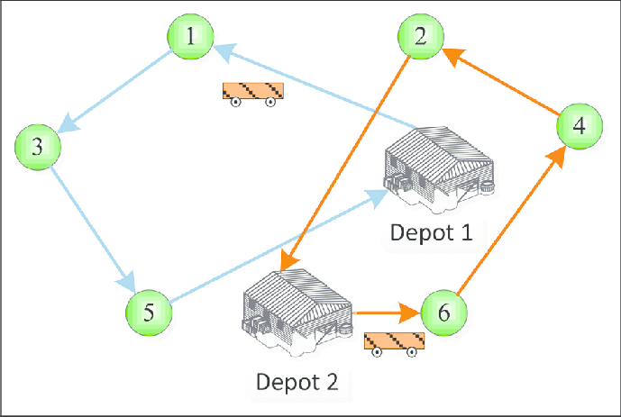

# Hệ Thống Logistics Thông Minh - VRP Solver

## 1. Tổng Quan Dự Án

### 1.1 Mục Tiêu
Xây dựng một **hệ thống tối ưu hóa lộ trình giao hàng** giúp:
- Tính toán đường đi ngắn nhất cho đội xe giao hàng
- Tiết kiệm chi phí nhiên liệu
- Giảm thời gian giao hàng
- Xử lý nhiều điểm dừng (khách hàng) hiệu quả

---
## 2. Bài Toán VRP (Vehicle Routing Problem)

### 2.1 Định Nghĩa
**VRP** là một trong những bài toán tối ưu hóa khó khăn trong vận hành và quản lý vận tải, phân phối và logistic. Mục tiêu là tìm ra các tuyến đường tối ưu cho nhiều phương tiện vận tải cho tập hợp các địa điểm nhận hàng, giao hàng và điểm dừng.

Làm rõ hơn về bài toán **VRP**:
- Cho **n điểm giao hàng** (khách hàng)
- Cho **m chiếc xe** (vehicles)
- Tìm **đường đi tối ưu** mà các xe phải đi qua để:
  - Phục vụ tất cả khách hàng
  - **Tối thiểu hóa**: tổng khoảng cách / chi phí
  - **Tuân thủ**: các ràng buộc (trọng lượng, thời gian, ...)

### 2.2 Ví Dụ Thực Tế


### 2.3 Độ Phức Tạp
- **VRP là NP-complete** → không tồn tại giải pháp tối ưu trong thời gian đa thức
- Với 10 điểm: ~3.6 triệu cách sắp xếp **(10!)**
- Với 100 điểm: con số này là **thiên vô cực** trong thực tế
- **Lời giải**: dùng Heuristic (Tham lam) + Metaheuristic (Giải thuật di truyền)

---

## 3. Các Biến Thể VRP

| Tên | Đặc Điểm | Ứng Dụng |
|-----|----------|---------|
| **TSP (Traveling Salesman Problem)** | 1 xe, 1 kho | Đơn giản nhất, tìm đường đi tối ưu cho một người đi qua tất cả địa điểm |
| **VRP mở rộng** | Nhiều xe, 1 kho | Giao hàng thực tế |
| **VRPTW** | + Khung giờ (time window) | Giao hàng đúng giờ |
| **CVRP** | + Dung tích xe | Giao hàng có trọng lượng |
| **MDVRP** | + Nhiều kho | Phân phối toàn quốc |

---

## 4. Stack Công Nghệ Dự Tính

```
Frontend: Streamlit / React (hiển thị bản đồ)
         ↓
Backend:  FastAPI (Python)
         ↓
Engine:   Gradient Boosting + Genetic Algorithm
         ↓
Data:     PostgreSQL (lưu điểm, tuyến đường)
         ↓
Mapping:  Google Maps API (khoảng cách thực tế)
         ↓
Utils:    NetworkX (đồ thị), Folium (bản đồ)
```
## 5. Chi Tiết Các Thành Phần Hệ Thống

### 5.1. Frontend (Giao diện người dùng)
* **Công cụ:** `Streamlit` (phục vụ prototype & visualization nhanh) / `React` (phục vụ scale ứng dụng).
* **Nhiệm vụ:**
  * Tiếp nhận tham số đầu vào từ người điều phối (số lượng xe, danh sách tọa độ điểm giao hàng, tải trọng).
  * Render bản đồ tương tác và hiển thị trực quan các tuyến đường (polylines) sau khi có kết quả tối ưu.

### 5.2. Backend (Xử lý logic & API Gateway)
* **Công cụ:** `FastAPI`
* **Nhiệm vụ:**
  * Cung cấp các RESTful API endpoints với tốc độ phản hồi cao nhờ cơ chế xử lý bất đồng bộ (async).
  * Đóng vai trò Controller: Nhận request từ Client $\rightarrow$ Validate dữ liệu $\rightarrow$ Gọi Mapping API $\rightarrow$ Đẩy dữ liệu vào Engine $\rightarrow$ Lưu kết quả xuống Database $\rightarrow$ Trả Response.

### 5.3. Optimization Engine (Bộ não thuật toán)
* **Công cụ:** `Scikit-learn`, `DEAP` (hoặc thư viện GA tự custom).
* **Nhiệm vụ:**
  * **Gradient Boosting:** Dự đoán và điều chỉnh trọng số thời gian di chuyển (ETA) dựa trên dữ liệu lịch sử hoặc các yếu tố ngoại cảnh (kẹt xe, thời tiết).
  * **Genetic Algorithm (GA):** Giải quyết sự bùng nổ tổ hợp của bài toán VRP. Sử dụng cơ chế lai ghép và đột biến để tìm ra cách phân bổ điểm giao hàng cho các xe sao cho tổng chi phí/thời gian là nhỏ nhất.

### 5.4. Database (Lưu trữ dữ liệu)
* **Công cụ:** `PostgreSQL` (Sử dụng `Supabase` như một công cụ database cloud hay backendservice để việc build hệ thống nhanh chóng hơn).
* **Nhiệm vụ:**
  * Lưu trữ cấu trúc dữ liệu quan hệ: Thông tin xe tải, chi nhánh kho, và danh sách đơn hàng.
  * Lưu trữ lịch sử các lộ trình đã tính toán để phục vụ làm tập dữ liệu huấn luyện (training data) cho các mô hình Machine Learning sau này.

### 2.5. Mapping & Utilities (Xử lý bản đồ và Đồ thị)
* **Google Maps API (Distance Matrix):** Cung cấp ma trận khoảng cách và thời gian di chuyển thực tế giữa các điểm. Đây là đầu vào cốt lõi để tính toán trọng số.
* **NetworkX:** Mô hình hóa các điểm giao hàng thành cấu trúc Đồ thị (Graph) trong bộ nhớ, giúp Engine dễ dàng thực hiện các phép toán duyệt đồ thị.
* **Folium:** Chuyển đổi dữ liệu tọa độ rời rạc thành các lớp bản đồ (map layers) chuẩn Leaflet.js để tích hợp thẳng lên giao diện UI.

---

## 6. Luồng Xử Lý Dữ Liệu Cơ Bản (Data Flow)

1. **Input:** Người dùng tải lên danh sách `N` điểm giao hàng qua UI.
2. **Request:** Client gửi payload chứa tọa độ xuống FastAPI.
3. **Distance Matrix:** FastAPI gọi Google Maps API lấy ma trận khoảng cách $N \times N$ giữa các điểm.
4. **Graph Construction:** Hệ thống dùng NetworkX để dựng đồ thị mạng lưới giao thông nội bộ.
5. **Prediction:** Gradient Boosting điều chỉnh trọng số các cạnh của đồ thị.
6. **Optimization:** Genetic Algorithm chạy qua các thế hệ để tìm ra lộ trình ghép xe tối ưu nhất.
7. **Mapping:** Dùng Folium vẽ kết quả lên bản đồ.
8. **Output:** FastAPI lưu log xuống PostgreSQL và trả JSON kèm file HTML bản đồ về cho Client hiển thị.


---

## 7. Giai Đoạn Phát Triển

### **Phase 1**: Cơ bản (2 Tuần)
- [ ] Lên kế hoạch tìm hiểu và phát triển bài tập
- [ ] Thuật toán Nearest Neighbor (tham lam)
- [ ] Tính khoảng cách Euclid
- [ ] API endpoint cơ bản
- [ ] Unit test

### **Phase 2**: Nâng cao (2-3 tuần)
- [ ] Genetic Algorithm
- [ ] Hỗ trợ nhiều xe
- [ ] Ràng buộc dung tích
- [ ] Tối ưu hóa chi phí

### **Phase 3**: Tích hợp (1-2 tuần)
- [ ] Google Maps API
- [ ] Cơ sở dữ liệu
- [ ] Frontend Streamlit
- [ ] Demo thực tế

### **Phase 4**: Hoàn thiện (1 tuần)
- [ ] Documentation
- [ ] Performance tuning
- [ ] Deployment (Web deploy)
- [ ] Presentation

---

## 8. Giải Thích Thuật Toán Sẽ Dùng

### 8.1 Nearest Neighbor (Tham Lam) - **Đơn giản, nhanh**
- Lựa chọn Nearest NeighBor vì nó dễ tiếp cận dù chưa quá hiệu quả nhưng sẽ dựng nhanh MVP sau này muốn thay đổi thuật toán cũng chỉ cần thay đổi trong layer engine
```
Bắt đầu từ Kho:
  1. Chọn điểm chưa ghé gần nhất
  2. Di chuyển đến đó
  3. Lặp lại cho đến kết thúc
  4. Quay về Kho

Độ phức tạp: O(n²)
Chất lượng: 70-80% so với tối ưu
Ưu: Nhanh, dễ hiểu
Nhược: Không luôn là tốt nhất
```

### 8.2 Genetic Algorithm (Di Truyền) - **Tốt hơn, chậm hơn**
```
Khái niệm: Mô phỏng quá trình tiến hóa tự nhiên

Bước:
  1. Tạo quần thể ban đầu (population) với các lộ trình ngẫu nhiên
  2. Đánh giá tất cả (fitness = khoảng cách)
  3. Chọn những lộ trình tốt nhất (selection)
  4. Kết hợp chúng (crossover) → tạo con đẻ
  5. Đột biến (mutation) → thêm tính ngẫu nhiên
  6. Lặp 100-1000 thế hệ
  
Chất lượng: 85-95% so với tối ưu
Ưu: Tốt, linh hoạt
Nhược: Chậm hơn, cần cấu hình
```

---

## 9. Kết Quả Kỳ Vọng

Sau hoàn thành, hệ thống sẽ:
```
Input:  [40.7128° N, 74.0060° W] ← Depot
        [1.2128° N, 74.0060° W] ← C1
        [2.7128° N, 74.0060° W] ← C2
        [0.7128° N, 74.0060° W] ← C3
        [4.7128° N, 74.0060° W] ← C4
        [1.7128° N, 74.0060° W] ← C5
        [2.7128° N, 74.0060° W] ← C6
        [1.7128° N, 74.0060° W] ← C7
                ↓
        Xử lý bằng Genetic Algorithm
                ↓
Output: V1: Depot → C2 → C5 → C7 → Depot (45km)
        V2: Depot → C1 → C3 → C4 → Depot (52km)
        V3: Depot → C6 → Depot (15km)
        
        Tổng: 112km (tiết kiệm 40% so với ngẫu nhiên)
```

---

## 10. Tài Liệu Tham Khảo

- [ ] Google OR-Tools Documentation
- [ ] Vehicle Routing Problems - Springer
- [ ] Network Optimization - MIT OpenCourseWare
- [ ] Python Genetic Algorithm Tutorial

