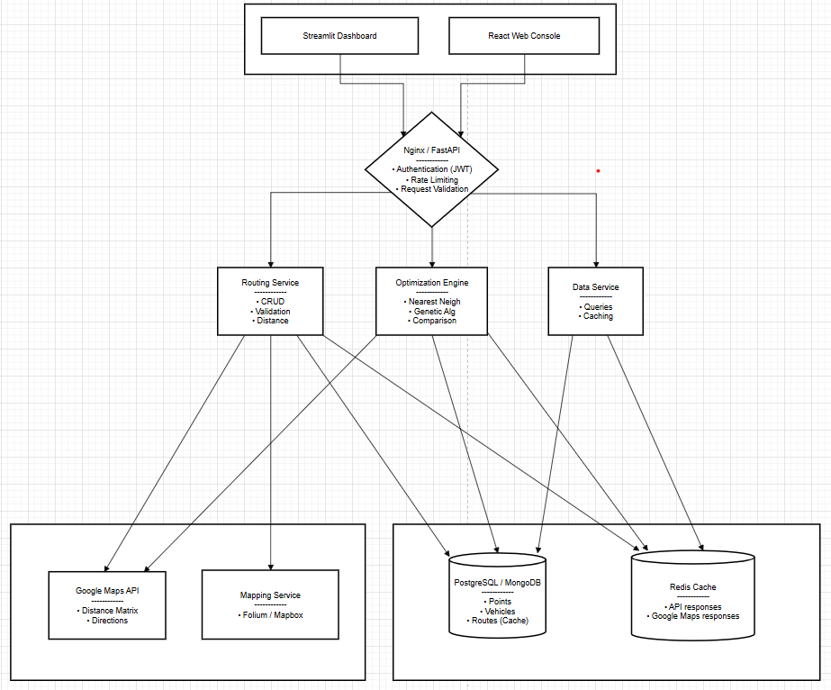

# Kiến Trúc Hệ Thống VRP

## 1. Sơ Đồ Kiến Trúc Tổng Quan



## 2. Cấu Trúc Thư Mục Dự Tính

```
vrp-solution/
│
├── docs/                          # Documentation
│   ├── 01-PROJECT_OVERVIEW.md
│   ├── 02-REQUIREMENTS.md
│   ├── 03-ARCHITECTURE.md         (you are here)
│   ├── 04-API_DESIGN.md
│   ├── 05-ALGORITHM_DETAILS.md
│   └── 06-SETUP_GUIDE.md
│
├── src/                           # Source code
│   ├── __init__.py
│   │
│   ├── models/                    # Data models
│   │   ├── __init__.py
│   │   ├── point.py              # Customer/location model
│   │   ├── vehicle.py            # Vehicle model
│   │   └── route.py              # Route result model
│   │
│   ├── services/                 # Business logic
│   │   ├── __init__.py
│   │   ├── routing_service.py    # CRUD operations
│   │   ├── distance_service.py   # Calculate distance
│   │   ├── optimization_service.py # GA + NN algorithms
│   │   └── maps_service.py       # Google Maps integration
│   │
│   ├── algorithms/               # Algorithm implementations
│   │   ├── __init__.py
│   │   ├── nearest_neighbor.py   # Greedy algorithm
│   │   ├── genetic_algorithm.py  # GA implementation
│   │   └── utils.py              # Helper functions
│   │
│   ├── database/                 # Database layer
│   │   ├── __init__.py
│   │   ├── connection.py         # DB connection setup
│   │   ├── models.py             # SQLAlchemy models
│   │   └── repositories.py       # Data access layer
│   │
│   ├── api/                      # REST API
│   │   ├── __init__.py
│   │   ├── router_api.py         # Routing endpoints
│   │   ├── vehicle_api.py        # Vehicle endpoints
│   │   ├── optimization_api.py   # Optimization endpoints
│   │   └── middleware/           # Authentication, logging
│   │       ├── __init__.py
│   │       └── auth.py
│   │
│   └── utils/                    # Utility functions
│       ├── __init__.py
│       ├── config.py             # Configuration
│       ├── logger.py             # Logging setup
│       └── validators.py         # Input validation
│
├── frontend/                      # Frontend (Optional)
│   ├── streamlit_app.py          # Streamlit dashboard
│   └── pages/
│       ├── dashboard.py
│       ├── routing.py
│       └── analytics.py
│
├── tests/                         # Unit tests
│   ├── __init__.py
│   ├── test_nearest_neighbor.py
│   ├── test_genetic_algorithm.py
│   ├── test_api.py
│   └── test_services.py
│
├── main.py                        # Entry point
├── requirements.txt               # Dependencies
├── config.py                      # Configuration file
├── .env.example                   # Environment variables template
├── .gitignore
├── README.md
└── LICENSE
```

---

## 3. Chi Tiết Các Component

### 3.1 **Models Layer** (Định nghĩa cấu trúc dữ liệu)

```python
# models/point.py
class Point:
    - id: str                    # Unique identifier
    - name: str                  # Location name
    - latitude: float            # Coordinates
    - longitude: float
    - demand: int                # Quantity (kg, units, ...)
    - service_time: int          # Minutes to serve
    - time_window: Optional[(start, end)]  # Time constraints
    - priority: int              # 1-5 (high = must do first)

# models/vehicle.py
class Vehicle:
    - vehicle_id: str
    - capacity: float            # Max load (kg/units)
    - cost_per_km: float         # Operating cost
    - cost_per_hour: float       # Labor cost
    - start_location: Point      # Depot address
    - max_shift_hours: int       # Working hours limit
    - available: bool

# models/route.py
class Route:
    - route_id: str
    - vehicle_id: str
    - path: List[Point]          # Order of locations
    - distance: float            # Total km
    - duration: float            # Total hours
    - cost: float                # Total cost
    - load_used: float           # Current utilization %
    - quality_score: float       # Algorithm quality (0-100)
```

### 3.2 **Services Layer** (Xử lý logic)

```
RoutingService (CRUD)
├── add_point(point)
├── remove_point(point_id)
├── get_all_points()
├── update_vehicle(vehicle)

DistanceService
├── calculate_distance_euclidean(p1, p2) → float
├── calculate_distance_haversine(p1, p2) → float  # Real world
├── get_distance_matrix(points) → matrix (Google Maps)

OptimizationService
├── solve_with_nearest_neighbor(points, vehicle) → Route
├── solve_with_genetic_algorithm(points, vehicles, config) → List[Route]
├── compare_algorithms(points, vehicles) → ComparisonResult
```

### 3.3 **Algorithm Layer** (Tính toán)

#### **VRP Solvers (Multi-Vehicle)**

```
vrp_solver.py              # Unified interface
├── Customer               # (id, lat, lng, demand)
├── Vehicle                # (id, capacity, depot_lat, depot_lng)
├── Route                  # Single vehicle route
└── VRPSolution            # Complete VRP solution

cvrp_solver.py             # Capacitated VRP solvers
├── SweepCVRPSolver        # Polar angle clustering
│   └── solve(customers, vehicles) → VRPSolution
├── GreedyCVRPSolver       # Greedy assignment
│   └── solve(customers, vehicles) → VRPSolution
└── solve_cvrp()           # Factory function

genetic_algorithm_vrp.py   # GA for multi-vehicle VRP
├── VRPChromosome          # {vehicle_id: [customer_ids]}
├── genetic_algorithm_vrp() → VRPSolution
│   ├── _create_initial_population_vrp()
│   ├── _calculate_chromosome_fitness()  # With penalties
│   ├── _crossover_vrp()     # Route-based crossover
│   └── _mutate_vrp()        # Swap/Move/Invert
```

#### **TSP Solvers (Single Vehicle - Legacy)**

```
nearest_neighbor.py
├── nearest_neighbor(distance_matrix) → (route, distance)
└── two_opt(route, matrix) → (improved_route, distance)

genetic_algorithm.py       # TSP only (single vehicle)
└── genetic_algorithm(distance_matrix) → (route, distance)

distance.py
├── haversine(lat1, lon1, lat2, lon2) → km
└── build_distance_matrix(points) → matrix
```

#### **Architecture Principle**

**Old (2-Stage):** Assignment → TSP for each vehicle  
**New (True VRP):** VRP solver optimizes assignment + routing simultaneously

```python
# Old approach - NOT optimal
assigned = assign_to_vehicles(customers, vehicles)  # No routing info
for vehicle, stops in assigned.items():
    route = solve_tsp(stops)  # Local optimization only

# New approach - True VRP optimization
solution = solve_cvrp(customers, vehicles, algorithm="sweep")
# or
solution = genetic_algorithm_vrp(customers, vehicles)
# → Globally optimized assignment + routing
```

### 3.4 **API Layer** (REST endpoints)

```
POST   /api/points                 # Add point
GET    /api/points                 # List points
PUT    /api/points/{id}            # Update point
DELETE /api/points/{id}            # Delete point

GET    /api/vehicles               # List vehicles
POST   /api/vehicles               # Add vehicle

POST   /api/optimize               # Calculate route (greedy)
POST   /api/optimize/ga            # Calculate route (GA)
GET    /api/routes/{route_id}      # Get route details
GET    /api/routes                 # List all routes

POST   /api/compare                # Compare algorithms
GET    /api/analytics              # Statistics & reports
GET    /api/map/{route_id}         # Visualization
```

### 3.5 **Database Layer** (Persistence)

```
Tables:
  - customers (id, name, lat, lon, demand, ...)
  - vehicles (id, capacity, cost_per_km, ...)
  - routes (id, vehicle_id, distance, cost, ...)
  - route_details (route_id, order, point_id, ...)
  
Indexes:
  - CREATE INDEX idx_point_id ON customers(id)
  - CREATE INDEX idx_vehicle_id ON vehicles(id)
```

### 3.6 **Database Caching** (Performance)

```
Redis Cache:
  - Key: "distance_matrix:{points_hash}"
    Value: {matrix data}
    TTL: 24 hours
    
  - Key: "route:{hash}"
    Value: {route data}
    TTL: 8 hours
    
  - Key: "maps_api:{origin}:{destination}"
    Value: {distance, duration}
    TTL: 7 days
```

---

## 4. Data Flow - Ví Dụ Real-time

```
Sự kiện: Người dùng upload danh sách 50 khách hàng

1. Frontend → API
   POST /api/points (batch)
   
2. API Layer
   ├── Validate input
   └── Call RoutingService.add_points()

3. RoutingService
   ├── Check duplicates
   ├── Save to DB
   └── Return success

4. User chọn "Tối ưu hóa"
   POST /api/optimize/ga
   {
     "point_ids": [...],
     "algorithm": "genetic",
     "vehicles": 10,
     "generations": 500
   }

5. OptimizationService
   ├── Fetch points from DB
   ├── Validate constraints
   └── Call GeneticAlgorithm.solve()

6. GeneticAlgorithm
   ├── Generate initial population (500 random routes)
   ├── For each generation (1-500):
   │   ├── Calculate fitness (distance)
   │   ├── Select best 50%
   │   ├── Crossover → 500 children
   │   ├── Mutation (10% random changes)
   │   └── Evaluate new population
   └── Return best route found

7. OptimizationService
   ├── Save results to cache
   ├── Save to DB
   └── Return to API

8. API
   ├── Prepare JSON response
   └── Return to Frontend

9. Frontend
   ├── Parse data
   ├── Draw map with route
   ├── Show metrics (distance, cost, time)
   └── Display to user
```

---

## 5. Quyết Định Thiết Kế Chính

| Tiêu Chí | Lựa Chọn | Lý Do |
|----------|---------|------|
| **Ngôn ngữ** | Python | Thư viện ML phong phú, nhanh phát triển |
| **Web Framework** | FastAPI | Hiệu năng, type hints, auto docs |
| **Database** | PostgreSQL | Reliable, spatial support, JSON |
| **Cache** | Redis | In-memory, fast, persistent |
| **Frontend** | Streamlit | Nhanh, Python-native, không cần JS |
| **Algorithm** | GA + NN | Balance tốc độ vs chất lượng |
| **Mapping** | Folium | Open-source, Python-friendly |
| **Testing** | pytest | Standard, powerful |
| **Deployment** | Docker | Reproducible, cloud-ready |

---

## 6. Lộ Trình Phát Triển (Development Timeline)

```
Week 1-2: Foundation
  ├── Setup project structure ✓
  ├── Create models & database
  ├── Build basic CRUD APIs
  └── Unit tests

Week 3-4: Algorithms
  ├── Nearest Neighbor algorithm
  ├── Genetic Algorithm implementation
  ├── Distance calculation (Euclidean + real)
  └── Algorithm comparison

Week 5-6: Integration
  ├── Database layer
  ├── Cache layer (Redis)
  ├── Google Maps API
  └── Performance optimization

Week 7-8: Frontend & Polish
  ├── Streamlit dashboard
  ├── Map visualization
  ├── Analytics/Reports
  ├── Full documentation
  └── Presentation preparation
```

