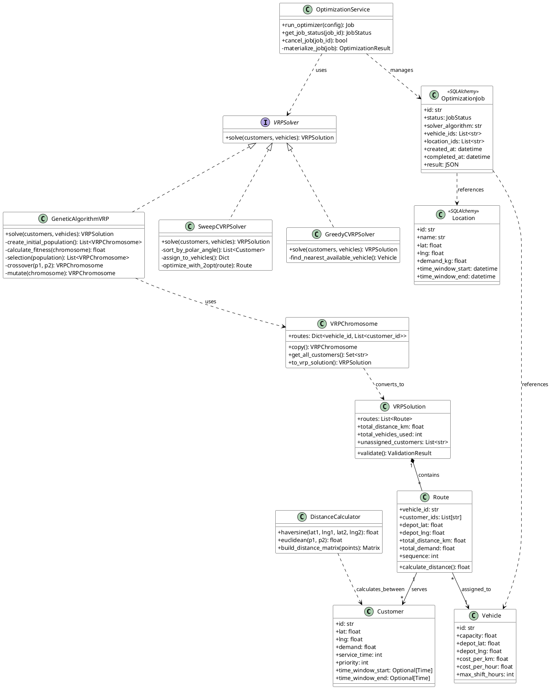
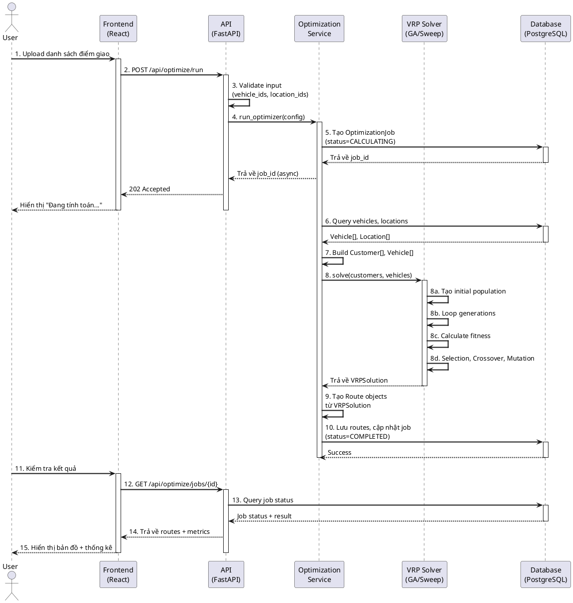

# Báo Cáo Hệ Thống Tối Ưu Hóa Lộ Trình Vận Tải (VRP)

## 1. Bài Toán Là Gì (Giới Thiệu Bài Toán)

### 1.1 Định Nghĩa Bài Toán VRP

**VRP (Vehicle Routing Problem)** là một trong những bài toán tối ưu hóa tổ hợp quan trọng nhất trong lĩnh vực vận tải, logistics và quản lý chuỗi cung ứng. Bài toán được định nghĩa như sau:

> **Input**: 
> - $n$ điểm giao hàng (khách hàng) với tọa độ và nhu cầu cụ thể
> - $m$ phương tiện vận tải (xe) với dung tích giới hạn
> - 1 kho hàng trung tâm (depot) là điểm xuất phát và kết thúc
>
> **Output**: 
> - Tập các lộ trình tối ưu cho từng xe
> - Mỗi khách hàng được phục vụ đúng 1 lần
> - Tổng khoảng cách/tổng chi phí được tối thiểu hóa
> - Tuân thủ các ràng buộc về dung tích, thời gian

### 1.2 Độ Phức Tạp Của Bài Toán

VRP thuộc lớp bài toán **NP-complete**, nghĩa là:

| Số điểm | Số hoán vị có thể | Thời gian duyệt toàn bộ (giả sử 1ms/hoán vị) |
|---------|-------------------|---------------------------------------------|
| 5 | 120 | 0.12 giây |
| 10 | 3.6 triệu | 1 giờ |
| 15 | 1.3 nghìn tỷ | 41 năm |
| 20 | 2.4 quintillion | 77 triệu năm |
| 100 | $100!$ | Vượt quá tuổi của vũ trụ |

→ **Kết luận**: Không thể giải tối ưu bằng brute force cho bài toán thực tế. Cần sử dụng các thuật toán heuristic và metaheuristic.

### 1.3 Các Biến Thể Của VRP

| Tên | Đặc Điểm | Ứng Dụng |
|-----|----------|----------|
| **TSP** | 1 xe, thăm tất cả điểm | Đơn giản nhất, baseline |
| **VRP cơ bản** | Nhiều xe, 1 kho | Giao hàng thực tế |
| **CVRP** | + Ràng buộc dung tích | Xe có giới hạn tải trọng |
| **VRPTW** | + Khung giờ giao hàng | Giao hàng đúng giờ hẹn |
| **MDVRP** | + Nhiều kho | Phân phối đa khu vực |
| **VRPPD** | + Nhận và giao hàng | Courier, logistics 2 chiều |

---

## 2. Bài Toán Giải Quyết Vấn Đề Gì

### 2.1 Vấn Đề Thực Tế

Trong logistics hiện đại, các doanh nghiệp đối mặt với:

1. **Chi phí nhiên liệu cao**: 30-40% tổng chi phí vận hành
2. **Thời gian giao hàng không đồng đều**: Khách hàng không hài lòng
3. **Sử dụng phương tiện kém hiệu quả**: Xe chạy không đầy tải, lộ trình chồng chéo
4. **Khó khăn khi quy mô tăng**: 100+ điểm giao không thể lập kế hoạch thủ công

### 2.2 Mục Tiêu Giải Quyết

| Mục tiêu | Chỉ số đo lường | Giá trị kỳ vọng |
|----------|-----------------|-----------------|
| **Tối thiểu chi phí** | Tổng km di chuyển | Giảm 25-40% so với lập kế hoạch thủ công |
| **Tối ưu thời gian** | Thời gian hoàn thành | Rút ngắn 20-30% thời gian giao hàng |
| **Tối ưu nguồn lực** | Số xe sử dụng | Giảm 10-20% số xe cần thiết |
| **Đảm bảo chất lượng** | % giao hàng đúng giờ | >95% đơn hàng đúng time window |

### 2.3 Lợi Ích Kinh Tế

Ví dụ thực tế: Công ty giao hàng với 50 xe, 1000 điểm giao/ngày

- **Trước tối ưu**: 50 xe × 200 km/ngày = 10,000 km/ngày
- **Sau tối ưu**: 45 xe × 160 km/ngày = 7,200 km/ngày
- **Tiết kiệm**: 2,800 km/ngày × 365 ngày × 15,000 VND/km = **15.3 tỷ VND/năm**

---

## 3. Các Thuật Toán Giải Quyết Bài Toán

### 3.1 Thuật Toán Nearest Neighbor (Tham Lam)

#### Ý Tưởng
Thuật toán tham lam đơn giản: tại mỗi bước, luôn chọn điểm chưa ghé thăm gần nhất từ vị trí hiện tại.

#### Pseudocode
```
FUNCTION nearest_neighbor(depot, customers):
    current ← depot
    unvisited ← customers
    route ← [depot]
    total_distance ← 0
    
    WHILE unvisited ≠ ∅:
        nearest ← NULL
        min_dist ← ∞
        
        FOR EACH point IN unvisited:
            dist ← haversine(current, point)
            IF dist < min_dist:
                min_dist ← dist
                nearest ← point
        
        route.ADD(nearest)
        total_distance ← total_distance + min_dist
        unvisited.REMOVE(nearest)
        current ← nearest
    
    # Quay về kho
    route.ADD(depot)
    total_distance ← total_distance + haversine(current, depot)
    
    RETURN Route(path=route, distance=total_distance)
```

#### Phân Tích Độ Phức Tạp

| Tiêu chí | Giá trị |
|----------|---------|
| **Time Complexity** | O(n²) - n vòng lặp ngoài, mỗi vòng tìm min trong (n-i) điểm |
| **Space Complexity** | O(n) - lưu route và danh sách unvisited |
| **Chất lượng lời giải** | 70-80% so với tối ưu toàn cục |
| **Thời gian thực thi** | < 100ms cho 100 điểm |

#### Ưu & Nhược Điểm

**Ưu điểm**:
- Đơn giản, dễ hiểu và triển khai
- Nhanh, phù hợp bài toán nhỏ
- Không yêu cầu bộ nhớ lớn

**Nhược điểm**:
- Dễ rơi vào cực tiểu cục bộ (local optimum)
- Không tính đến cấu trúc tổng thể của đồ thị
- Quyết định đầu (chọn điểm gần nhất) có thể dẫn đến đường đi tệ ở cuối

---

### 3.2 Thuật Toán Genetic Algorithm (GA)

#### Ý Tưởng
Mô phỏng quá trình tiến hóa tự nhiên: các lộ trình (individuals) cạnh tranh, lai ghép, đột biến qua nhiều thế hệ để tìm lời giải tối ưu.

#### Các Thành Phần Chính

| Thành phần                     | Mô tả               | Trong VRP                           |
| --------------------------------| ---------------------| -------------------------------------|
| **Chromosome (Nhiễm sắc thể)** | Một lời giải        | Danh sách các điểm theo thứ tự thăm |
| **Population (Quần thể)**      | Tập lời giải        | Tập hợp 50-200 lộ trình khác nhau   |
| **Fitness (Độ thích nghi)**    | Chất lượng lời giải | 1 / (tổng khoảng cách)              |
| **Selection (Chọn lọc)**       | Chọn lời giải tốt   | Tournament selection                |
| **Crossover (Lai ghép)**       | Kết hợp 2 lời giải  | Order Crossover (OX)                |
| **Mutation (Đột biến)**        | Thay đổi ngẫu nhiên | Hoán đổi 2 điểm trong route         |

#### Pseudocode
```
FUNCTION genetic_algorithm(customers, population_size, generations, mutation_rate):
    # Bước 1: Khởi tạo quần thể ngẫu nhiên
    population ← []
    FOR i ← 1 TO population_size:
        route ← RANDOM_SHUFFLE(customers)
        population.ADD([depot] + route + [depot])
    
    best_solution ← NULL
    best_fitness ← 0
    
    # Bước 2: Tiến hóa qua các thế hệ
    FOR gen ← 1 TO generations:
        # 2a: Đánh giá fitness
        fitness_scores ← []
        FOR EACH individual IN population:
            distance ← calculate_route_distance(individual)
            fitness ← 1.0 / distance
            fitness_scores.ADD(fitness)
            
            IF fitness > best_fitness:
                best_fitness ← fitness
                best_solution ← individual
        
        # 2b: Chọn lọc (Tournament Selection)
        parents ← []
        FOR i ← 1 TO population_size/2:
            tournament ← RANDOM_SAMPLE(population, 3)
            winner ← MAX(tournament, key=fitness)
            parents.ADD(winner)
        
        # 2c: Lai ghép tạo thế hệ mới
        offspring ← []
        WHILE offspring.SIZE < population_size:
            p1 ← RANDOM_CHOICE(parents)
            p2 ← RANDOM_CHOICE(parents)
            child ← ORDER_CROSSOVER(p1, p2)
            offspring.ADD(child)
        
        # 2d: Đột biến
        FOR EACH child IN offspring:
            IF RANDOM() < mutation_rate:
                SWAP_MUTATION(child)
        
        population ← offspring
    
    RETURN best_solution
```

#### Phân Tích Độ Phức Tạp

| Tiêu chí | Giá trị |
|----------|---------|
| **Time Complexity** | O(G × P × n²) với G=generations, P=population_size |
| **Space Complexity** | O(P × n) - lưu toàn bộ quần thể |
| **Chất lượng lời giải** | 85-95% so với tối ưu toàn cục |
| **Thời gian thực thi** | 3-10 giây cho 100 điểm (G=500, P=100) |

#### Cấu Hình Tối Ưu

| Tham số | Giá trị khuyến nghị | Ý nghĩa |
|---------|---------------------|---------|
| `population_size` | 50-100 | Quần thể lớn = tìm kiếm toàn diện hơn |
| `generations` | 300-500 | Thường hội tụ sau 300 thế hệ |
| `mutation_rate` | 0.05-0.15 | 10% là cân bằng tốt |
| `elite_size` | 5-10 | Bảo tồn cá thể tốt nhất giữa các thế hệ |

---

### 3.3 Thuật Toán Sweep (Multi-Vehicle)

#### Ý Tưởng
Phân bổ khách hàng cho nhiều xe dựa trên góc cực (polar angle) từ kho:

1. Tính góc của mỗi khách hàng so với kho (0° → 360°)
2. Sắp xếp khách hàng theo góc tăng dần
3. "Quét" vòng tròn, gán khách hàng cho xe hiện tại
4. Khi đầy capacity → chuyển sang xe tiếp theo
5. Tối ưu mỗi route bằng 2-opt

#### Pseudocode
```
FUNCTION sweep_cvrp(customers, vehicles, depot):
    # 1: Tính góc cực và sắp xếp
    FOR EACH c IN customers:
        c.angle ← ATAN2(c.lng - depot.lng, c.lat - depot.lat)
    sorted_customers ← SORT_BY(customers, angle)
    
    # 2: Khởi tạo routes rỗng
    routes ← {v.id: [] FOR v IN vehicles}
    loads ← {v.id: 0 FOR v IN vehicles}
    current_vehicle_idx ← 0
    
    # 3: Phân bổ bằng sweep
    FOR EACH customer IN sorted_customers:
        assigned ← FALSE
        attempts ← 0
        
        WHILE attempts < vehicles.COUNT AND NOT assigned:
            v_idx ← (current_vehicle_idx + attempts) MOD vehicles.COUNT
            vehicle ← vehicles[v_idx]
            
            IF loads[vehicle.id] + customer.demand ≤ vehicle.capacity:
                routes[vehicle.id].ADD(customer.id)
                loads[vehicle.id] ← loads[vehicle.id] + customer.demand
                current_vehicle_idx ← v_idx
                assigned ← TRUE
            ELSE:
                attempts ← attempts + 1
    
    # 4: Tối ưu mỗi route
    FOR EACH route IN routes:
        IF route.NOT_EMPTY():
            route ← TWO_OPT(route)
    
    RETURN routes
```

#### Phân Tích

| Tiêu chí | Giá trị |
|----------|---------|
| **Time Complexity** | O(n log n) - chủ yếu là sắp xếp |
| **Chất lượng** | ⭐⭐⭐ Tốt cho phân bổ địa lý |
| **Điểm mạnh** | Nhanh, tự nhiên (khách gần nhau về góc thường gần về địa lý) |
| **Điểm yếu** | Không xử lý tốt khi khách cùng góc nhưng xa depot |

---

### 3.4 So Sánh Các Thuật Toán

| Thuật toán | Tốc độ | Chất lượng | Phù hợp khi |
|------------|--------|-----------|-------------|
| **Nearest Neighbor** | ⚡⚡⚡ (0.05s) | ⭐⭐ (70-80%) | Bài toán nhỏ, cần nhanh |
| **Sweep** | ⚡⚡⚡ (0.1s) | ⭐⭐⭐ (75-85%) | Nhiều xe, phân bố địa lý |
| **Genetic Algorithm** | ⚡⚡ (3-10s) | ⭐⭐⭐⭐⭐ (85-95%) | Cần tối ưu nhất, chấp nhận chờ |

---

## 4. Triển Khai Hệ Thống

### 4a. Sơ Đồ Class Tổng Quan (PlantUML)



#### Giải Thích Các Class Chính

| Class | Nhiệm vụ |
|-------|----------|
| **Customer** | Đại diện điểm giao hàng với tọa độ, nhu cầu, khung giờ |
| **Vehicle** | Đại diện phương tiện với dung tích, vị trí kho, chi phí |
| **Route** | Lộ trình của 1 xe: danh sách điểm, tổng khoảng cách |
| **VRPSolution** | Lời giải hoàn chỉnh: tập hợp các route |
| **VRPSolver** | Interface cho các thuật toán giải VRP |
| **VRPChromosome** | Biểu diễn lời giải cho GA: {vehicle_id: [customers]} |
| **OptimizationService** | Xử lý nghiệp vụ: chạy optimizer, quản lý job |

---

### 4b. Sơ Đồ Sequence (Luồng Chính)



#### Luồng Xử Lý Chi Tiết

| Bước | Thành phần | Hành động |
|------|------------|-----------|
| 1-2 | User → Frontend → API | Gửi yêu cầu tối ưu với danh sách điểm và xe |
| 3 | API | Validate input: kiểm tra vehicle_ids, location_ids hợp lệ |
| 4-5 | API → Service → DB | Tạo job trong database, trả về job_id ngay lập tức (async) |
| 6-8 | Service → Solver | Query data, chạy thuật toán VRP (GA hoặc Sweep) |
| 8a-8d | Solver | Tiến hóa quần thể qua 300-500 thế hệ |
| 9-10 | Service → DB | Tạo Route records, cập nhật job status = COMPLETED |
| 11-15 | User → Frontend | Polling kiểm tra kết quả, hiển thị bản đồ và metrics |

---

### 4c. Công Cụ Được Sử Dụng

#### Stack Công Nghệ Tổng Quan

```
┌─────────────────────────────────────────────────────────────┐
│                        FRONTEND                              │
│  React + TypeScript + Tailwind CSS + Vite                   │
│  Leaflet / Mapbox (Bản đồ tương tác)                        │
├─────────────────────────────────────────────────────────────┤
│                        BACKEND                               │
│  Python 3.11 + FastAPI (REST API, async)                    │
│  Pydantic (Data validation)                                  │
│  Uvicorn (ASGI server)                                       │
├─────────────────────────────────────────────────────────────┤
│                    OPTIMIZATION ENGINE                      │
│  Custom Python Algorithms                                   │
│  ├── Nearest Neighbor (Greedy)                             │
│  ├── Sweep Algorithm                                       │
│  ├── Genetic Algorithm (Multi-vehicle VRP)              │
│  └── 2-opt Local Search                                    │
├─────────────────────────────────────────────────────────────┤
│                       DATABASE                               │
│  PostgreSQL 15 + SQLAlchemy (ORM)                          │
│  Alembic (Migrations)                                        │
├─────────────────────────────────────────────────────────────┤
│                    EXTERNAL APIs                            │
│  Nominatim OSM (Geocoding)                                  │
└─────────────────────────────────────────────────────────────┘
```

#### Chi Tiết Công Cụ

| Layer | Công cụ | Phiên bản | Mục đích |
|-------|---------|-----------|----------|
| **Frontend** | React | 18.x | UI components, state management |
| | TypeScript | 5.x | Type safety |
| | Tailwind CSS | 3.x | Styling |
| | Lucide React | Latest | Icons |
| **Backend** | Python | 3.11+ | Core language |
| | FastAPI | 0.104+ | REST API framework |
| | Pydantic | 2.x | Data validation |
| | Uvicorn | Latest | ASGI server |
| **Database** | PostgreSQL | 15.x | Relational data storage |
| | SQLAlchemy | 2.x | ORM |
| | Alembic | Latest | Database migrations |
| **Algorithms** | NumPy | Latest | Numerical operations |
| | Custom Python | - | VRP solvers |
| **DevOps** | Docker | Latest | Containerization |
| | Git | Latest | Version control |

---

### 4d. Các API Bên Thứ 3 Sử Dụng

#### 1. Nominatim OpenStreetMap (Geocoding)

**Mục đích**: Chuyển đổi địa chỉ văn bản thành tọa độ GPS (lat, lng)

**Endpoint**:
```
GET https://nominatim.openstreetmap.org/search?q={address}&format=json&limit=5
```

**Request Parameters**:
| Parameter | Type | Mô tả |
|-----------|------|-------|
| `q` | string | Địa chỉ cần tìm kiếm |
| `format` | string | Định dạng trả về (json) |
| `limit` | int | Số kết quả tối đa |

**Response Example**:
```json
[
  {
    "place_id": 123456789,
    "lat": "10.8231",
    "lon": "106.6297",
    "display_name": "123 Nguyễn Văn A, Quận 1, TP.HCM, Việt Nam",
    "type": "house"
  }
]
```

**Sử dụng trong hệ thống**:
```python
# File: vrp-solution/app/services/address_service.py (giả định)
async def geocode_address(address: str) -> Optional[Location]:
    url = f"https://nominatim.openstreetmap.org/search"
    params = {
        "q": address,
        "format": "json",
        "limit": 1
    }
    async with aiohttp.ClientSession() as session:
        async with session.get(url, params=params) as response:
            data = await response.json()
            if data:
                return Location(
                    lat=float(data[0]["lat"]),
                    lng=float(data[0]["lon"]),
                    address=data[0]["display_name"]
                )
    return None
```

**Giới hạn**:
- Rate limit: 1 request/second (miễn phí)
- Yêu cầu điền User-Agent header
- Không dùng cho production scale lớn (cần server riêng hoặc dịch vụ trả phí)

#### 2. Các API Tùy Chọn Khác

| API | Mục đích | Trạng thái |
|-----|----------|-------------|
| **Google Maps Distance Matrix** | Khoảng cách thực tế theo đường bộ | Tùy chọn (cần API key) |
| **OpenRouteService** | Routing, isochrones | Tùy chọn (miễn phí tier) |
| **GraphHopper** | OSM-based routing | Self-hosted option |

**Lưu ý**: Hệ thống hiện tại sử dụng **Haversine distance** để tính khoảng cách chim bay giữa các điểm, đủ chính xác cho mục đích tối ưu và không phụ thuộc API bên thứ 3 cho core algorithm.

---

## 5. Tổng Kết

### 5.1 Đóng Góp Chính

1. **Thuật toán VRP đa phương tiện**: Triển khai Genetic Algorithm cho bài toán VRP thực sự (không phải TSP đơn giản)
2. **Kiến trúc module hóa**: Dễ dàng thay thế, mở rộng thuật toán
3. **Hệ thống async**: Job-based optimization, không block người dùng
4. **Giao diện trực quan**: Bản đồ tương tác, thống kê real-time

### 5.2 Hướng Phát Triển

| STT | Hướng phát triển | Mô tả |
|-----|-----------------|-------|
| 1 | **VRPTW** | Thêm ràng buộc khung giờ giao hàng |
| 2 | **Dynamic VRP** | Xử lý đơn hàng real-time, điều chỉnh route đang chạy |
| 3 | **ML Prediction** | Dự đoán thời gian giao dựa trên lịch sử |
| 4 | **Hybrid Solver** | Kết hợp Constraint Programming + GA |
| 5 | **Mobile App** | Ứng dụng cho tài xế, theo dõi real-time |

---

## Phụ Lục

### A. Tham Khảo

1. Dantzig, G. B., & Ramser, J. H. (1959). "The Truck Dispatching Problem". Management Science.
2. Toth, P., & Vigo, D. (2014). "Vehicle Routing: Problems, Methods, and Applications". SIAM.
3. Eiben, A. E., & Smith, J. E. (2015). "Introduction to Evolutionary Computing". Springer.

### B. Tài Nguyên Mã Nguồn

- Repository: `vrp-solution/`
- Backend: `vrp-solution/app/`
- Frontend: `vrp-web/src/`
- Documentation: `vrp-solution/docs/`

---

*Document generated for VRP System Report*  
*Version: 1.0*  
*Date: May 2026*
